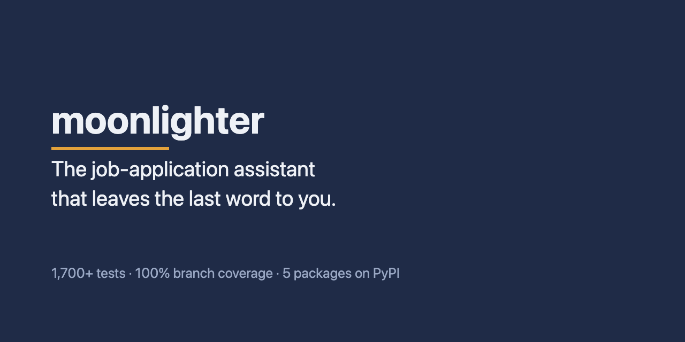
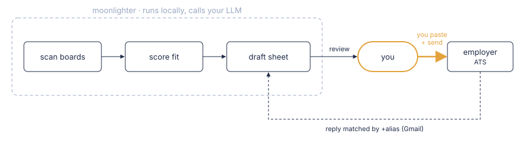

🇺🇸 [English](README.md) · 🇧🇷 [Português](README.pt.md)



# moonlighter

**The job-application assistant that leaves the last word to you.**

Scans the job boards you choose, scores each posting against your profile, and drafts a complete answer sheet from your own data, flagging what it can't answer.

Built by Alberto Cavalcanti · [Connect on LinkedIn](https://www.linkedin.com/in/albertosca/) · [Read the docs](https://albertosca.github.io/moonlighter/) · [Install](https://albertosca.github.io/moonlighter/getting-started/install/)

<!-- facts -->1,700+ tests · 100% branch coverage (CI-gated) · 5 packages on PyPI · mypy strict<!-- /facts -->

[](https://pypi.org/project/moonlighter/) [](https://pypi.org/project/moonlighter/) [](https://github.com/albertosca/moonlighter/actions/workflows/ci.yml) [](LICENSE) [](https://github.com/albertosca/moonlighter/actions/workflows/ci.yml) [](https://github.com/albertosca/moonlighter/actions/workflows/ci.yml)

## Sixty seconds of it

```text
You: scan my companies

moonlighter: 3 sources scanned — 41 postings, 38 already known, 3 new
  ✓ NEW — Acme Robotics / Senior Backend Engineer
    Score: 8.1/10  (threshold: 6.5)
  ✓ NEW — Nimbus Health / Staff Engineer
    Score: 7.4/10
  ✗ Vandelay Industries / .NET Architect — 3.2/10, archived (hard filter: .NET)

You: prepare the application for the Acme one

moonlighter: Senior Backend Engineer — Acme Robotics

  [1/9] Full name  (required)
  Ana Lima

  [2/9] Email  (required)
  ana.jobs+k3xv9q@gmail.com     ← tracking alias: Acme's reply will match this application by itself

  [3/9] Why do you want to work at Acme?  (required)
  Three sentences drafted from Ana's profile.

  [4/9] Desired salary  (required)
  BRL 28.000/month

  [5/9] Do you hold a US work visa?  (required)
  !! I DON'T KNOW — no basis in your profile to answer

  1 of 9 need you

You: (review it, paste it into the form, hit send — moonlighter never does)
```

The conversation is illustrative: Claude relays the tool output in its own words. The gap is real behaviour — the model is told to answer UNKNOWN when your profile gives it no basis, and the sheet hands that question back to you.

## How it works

<picture>
  <source media="(prefers-color-scheme: dark)" srcset="assets/diagrams/how-it-works-dark.svg">
  
</picture>

- **Scan** — reads job boards on Greenhouse, Lever, Ashby, Recruitee, Workable, SmartRecruiters and InHire for the companies you list, plus optional job portals you switch on in config.
- **Evaluate** — an LLM scores each posting against your profile; postings below your threshold are archived.
- **Prepare** — drafts an answer for every question on the form into one sheet you review, paste and send; optionally, a one-page CV tailored to the posting.
- **Track** — matches recruiter replies in Gmail to the right application by its `+alias` and moves your pipeline forward.

You drive it from a Claude conversation through MCP tools; the scan, apply and email packages also install JSON command lines for shells and cron jobs.

## What it won't do

- **It never sends an application.** It drafts the sheet; you paste the answers into the employer's form and send it yourself.
- **Your pipeline lives in a local SQLite file.** Jobs, drafts and application history are stored under `MOONLIGHTER_HOME`. What leaves your machine is only what goes to the LLM and the APIs you configure — Claude, Gmail, the job boards. [PRIVACY.md](PRIVACY.md) has the details.
- **The model never answers a question the guards recognise as salary, compliance or demographic.** Those come from your config or are left to you. The guards match known phrasings, and when you paste in a page's text, the model still reads all of it to find the questions.

The model can still get an answer wrong — which is why every sheet is yours to review.

## Engineering decisions

Applications go out under your name, so the bar is trust. Each decision below bought safety at a price; the [Engineering page](https://albertosca.github.io/moonlighter/engineering/) records what each one cost and where to check it in the code.

| Decision | Trade-off we accepted |
|---|---|
| [Stopped driving the browser](https://albertosca.github.io/moonlighter/engineering/#stopped-driving-the-browser) | Every application costs you a paste and a click |
| [Deterministic guards around the drafting step](https://albertosca.github.io/moonlighter/engineering/#deterministic-guards-around-the-drafting-step) | They recognise known phrasings only |
| [Model text escaped into the CV's LaTeX, never validated](https://albertosca.github.io/moonlighter/engineering/#model-text-escaped-never-validated-into-the-cvs-latex) | Model output can't carry LaTeX formatting beyond bold |
| [Five slices with a tested import boundary and lockstep releases](https://albertosca.github.io/moonlighter/engineering/#five-slices-with-a-tested-import-boundary-and-lockstep-releases) | Every release bumps five packages by hand |
| [100% branch coverage as a gate, gates proven by canaries](https://albertosca.github.io/moonlighter/engineering/#100-branch-coverage-as-a-gate-gates-proven-by-canaries) | Every new branch costs a test |

## Install

You need [uv](https://docs.astral.sh/uv/) (it fetches Python 3.14 for you) and an LLM backend: the Claude Code CLI by default, or an Anthropic API key.

- **Claude Code:** `/plugin marketplace add albertosca/moonlighter`, then `/plugin install moonlighter@moonlighter`.
- **Any other MCP client:** register the server command `uvx moonlighter`.
- **Then:** `uvx moonlighter init` writes your config; fill in `profile.yaml` and `company_list.yaml`, and ask Claude to "scan my companies".

[Full install guide →](https://albertosca.github.io/moonlighter/getting-started/install/)

## Documentation

- [Getting started](https://albertosca.github.io/moonlighter/getting-started/install/) — requirements, the setup wizard, registering the MCP server
- [Tailored CV](https://albertosca.github.io/moonlighter/guides/tailored-cv/) — a one-page LaTeX CV per posting, built from bullets you curated
- [Answer bank](https://albertosca.github.io/moonlighter/guides/answer-bank/) — screening answers you approved, reused on the next application
- [Command line](https://albertosca.github.io/moonlighter/reference/cli/) — a JSON CLI per slice, exit codes, what each install gives you
- [MCP tools](https://albertosca.github.io/moonlighter/reference/mcp-tools/) — the 17 tools Claude calls on your behalf
- [Extensions](https://albertosca.github.io/moonlighter/guides/extensions/) — add a job source as a separate package

Questions and troubleshooting: [FAQ](https://albertosca.github.io/moonlighter/faq/). Working on the code: [CONTRIBUTING.md](CONTRIBUTING.md).

## License

AGPL-3.0 — see [LICENSE](LICENSE): use it, fork it, modify it, as long as what you distribute or serve over a network stays open. Want to offer moonlighter as a hosted or paid service without the AGPL's obligations? A commercial license is available — [open an issue](https://github.com/albertosca/moonlighter/issues) to start that conversation; the [CLA](CLA.md) every contributor signs keeps that offer possible.

[DISCLAIMER.md](DISCLAIMER.md) covers terms of service, automation and LLM backend usage; [PRIVACY.md](PRIVACY.md) covers what the tool stores and where it goes.

---

Built by Alberto Cavalcanti — [Connect on LinkedIn](https://www.linkedin.com/in/albertosca/)
