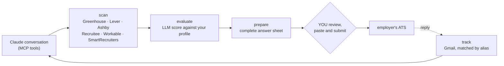

> **[Leia em Português](README.pt.md)**

# moonlighter

[](https://pypi.org/project/moonlighter/)
[](https://pypi.org/project/moonlighter/)
[](https://github.com/albertosca/moonlighter/actions/workflows/ci.yml)
[](LICENSE)

AI-powered job application pipeline. Scans job boards, scores candidate fit via LLM, and composes every answer a job application form asks for — all driven from Claude through a [Model Context Protocol](https://modelcontextprotocol.io) (MCP) server. moonlighter never opens a browser to fill or submit a form, and never submits an application on your behalf — see [How it works](#how-it-works) below and [DISCLAIMER.md](DISCLAIMER.md).

## How it works



1. **Scan** — fetches job listings from Greenhouse, Lever, Ashby, Recruitee, Workable, and SmartRecruiters for a company list you configure, plus optional remote-first boards (RemoteOK, Remotive, WeWorkRemotely, HN Who's Hiring) and Gupy, both config-gated off by default. LinkedIn scanning is available as a separate, privately-distributed extension — see [Extensions (adding a new ATS scanner)](#extensions-adding-a-new-ats-scanner) below.
2. **Evaluate** — scores each job against your profile using an LLM; jobs below the threshold are archived automatically.
3. **Prepare** — `prepare_application` reads the form's questions (from the ATS API where one publishes them, e.g. Greenhouse/Recruitee) and composes an answer for every question it can, curated from your profile. It renders one reviewable sheet — the whole application, not a screenshot of a fraction of it — with any question it couldn't answer flagged for you. When no API publishes the questions, `prepare_application_from_paste` does the same from text you copy off the page yourself. Either way, you paste the answers into the form and submit it — moonlighter never touches the form or clicks submit.
4. **Track** — monitors your Gmail inbox for interview invitations and updates the pipeline status.

All steps are exposed as MCP tools and orchestrated by Claude in a conversation.

## Architecture

A [uv workspace](https://docs.astral.sh/uv/concepts/workspaces/) of 5 namespace packages (`moonlighter.*`), feature-sliced:

| Package | Namespace | Purpose |
|---------|-----------|---------|
| `moonlighter-core` | `moonlighter.core` | DB (Peewee/SQLite), config, optional browser driver (`[browser]` extra), LLM client |
| `moonlighter-scan` | `moonlighter.discovery` | ATS scrapers and LLM-based job scoring |
| `moonlighter-apply` | `moonlighter.application` | Answer composer (curated profile → LLM answers) and work-auth resolver |
| `moonlighter-email` | `moonlighter.tracking` | Gmail sync and interview stage classification |
| `moonlighter` | `moonlighter.server` | FastMCP server — wires all packages together |

## Requirements

- [uv](https://docs.astral.sh/uv/) — fetches Python 3.14 for you; no separate install needed
- Chrome, Chromium, or Brave — optional, only needed if you install a browser-based scan extension (e.g. LinkedIn scanning, see [Extensions](#extensions-adding-a-new-ats-scanner) below). The base product (scanning the configured ATS APIs and preparing applications) never opens a browser.
- An LLM backend, switchable in `config.yaml` at any time:
  - `llm_backend: cli` (default) — the [Claude Code CLI](https://claude.ai/code), billed to your
    Claude subscription. No API key.
  - `llm_backend: api` — the Anthropic SDK, billed to API credits. Requires `ANTHROPIC_API_KEY`
    in the environment.
- Gmail OAuth credentials (optional — only for email tracking)

## Setup

In a hurry? The whole thing is:

```bash
uvx moonlighter init                  # wizard: writes config.yaml
# fill in profile.yaml and company_list.yaml (examples below)
claude mcp add-json --scope user moonlighter '{"command":"uvx","args":["moonlighter"]}'
# new Claude session → "scan my companies"
```

The details:

### Option A — Claude Code plugin (recommended)

```
/plugin marketplace add albertosca/moonlighter
/plugin install moonlighter@moonlighter
```

The first command registers the marketplace; the second installs the plugin from it.

Then run the setup wizard:

```bash
uvx moonlighter init
```

### Option B — any MCP client

```bash
uvx moonlighter init
```

Then register the MCP server:

```bash
claude mcp add-json --scope user moonlighter '{"command":"uvx","args":["moonlighter"]}'
```

Using a different MCP client? Register the same command and args (`uvx` / `["moonlighter"]`) with
your client's own registration mechanism — the `claude mcp add-json` command above is specific to
the Claude Code CLI.

### After either option

The wizard writes `config.yaml` into `MOONLIGHTER_HOME` (defaults to `~/.moonlighter/`). Two
files still need your input:

| File | What goes in it |
|------|-----------------|
| `profile.yaml` | Your experience, skills, and `criteria` (the hard and soft filters that drive scoring) |
| `company_list.yaml` | The companies to scan and which ATS each one uses |

Start from [`profile.example.yaml`](https://raw.githubusercontent.com/albertosca/moonlighter/main/profile.example.yaml) and [`company_list.example.yaml`](https://raw.githubusercontent.com/albertosca/moonlighter/main/company_list.example.yaml).

The wizard writes a minimal `config.yaml`; [`config.example.yaml`](https://raw.githubusercontent.com/albertosca/moonlighter/main/config.example.yaml) documents the rest of the configuration surface, notably the `cv` block (only needed to use a different resume per company — by default
`prepare_application` points you at `cv.pdf` from `MOONLIGHTER_HOME` for the form's file-upload question, and
tells you plainly if none is configured) and the `email` block. `profile.yaml`, `company_list.yaml`,
`config.yaml`, and `cv.pdf` (your resume — moonlighter names it for you to attach, never uploads it itself)
all belong in `MOONLIGHTER_HOME` (defaults to `~/.moonlighter/`).

Once connected, ask Claude to run `get_pipeline` — besides the application funnel, it reports setup problems such as a missing profile, CV, or browser.

Restart Claude Code, or start a new session, before the moonlighter tools appear.

### Gmail tracking (optional)

1. Create a project in [Google Cloud Console](https://console.cloud.google.com), enable the
   Gmail API, and download OAuth credentials as `client.json`.
2. Place the file at `~/.moonlighter/gmail-client.json`.
3. The first call to `setup_email` opens a browser for authorization and saves the token.

### Developing on moonlighter

To work on the code rather than just use it, see [CONTRIBUTING.md](CONTRIBUTING.md).

## MCP tools

| Tool | Description |
|------|-------------|
| `scan_and_evaluate` | Fetch and score jobs from all configured ATS sources |
| `list_jobs` | List jobs by status (`new`, `scored`, `applied`, `archived`, …) |
| `get_job` | Show full details and pipeline history for a job |
| `add_job` | Manually add a job by URL |
| `prepare_application` | Compose every answer for a job's application form into one reviewable sheet, for you to paste in and submit yourself |
| `prepare_application_from_paste` | Same as `prepare_application`, for a form whose questions no API publishes — pass it the text you copied off the page |
| `update_status` | Manually move a job through the pipeline |
| `setup_email` | Authorize Gmail OAuth |
| `sync_email_responses` | Pull latest replies and classify interview stages |
| `get_pipeline` | Full pipeline summary |

## Extensions (adding a new ATS scanner)

Every ATS integration you see above (Greenhouse, Lever, Ashby, Recruitee, Workable, SmartRecruiters, Gupy)
is a normal part of this repo — but moonlighter also supports **scanner extensions**: separate,
independently installed Python packages that register a new job-listing source without forking or
modifying this repo at all. This is how LinkedIn scanning is distributed — not because the mechanism is
LinkedIn-specific, but because LinkedIn's own Terms of Service explicitly and unambiguously prohibit
automation (see [DISCLAIMER.md](DISCLAIMER.md)), so that integration ships as an opt-in extension instead
of bundled code anyone who clones this repo gets by default.

Browser-driven form filling and submission is not part of this repo at all (see
[How it works](#how-it-works) above) and is not an extension point — `prepare_application` composes
answers for you to paste yourself, for any ATS.

### How it works

An extension is a normal Python package that:

1. Depends on `moonlighter-core` and `moonlighter-scan`, pinned to a released tag of this repo.
2. Ships its own module implementing a `BaseScanner` subclass (see
   `packages/scan/moonlighter/discovery/sources/base.py`).
3. Declares itself via `entry_points` in its own `pyproject.toml` — no code in this repo ever imports or
   names the extension:

```toml
[project.entry-points."moonlighter.scanners"]
my_platform = "my_package.my_module:MyScanner"

# Optional: a browser-based staleness check for a source with no listing API
[project.entry-points."moonlighter.staleness_checkers"]
my_platform = "my_package.my_module:check_staleness"
```

A browser-based scanner (like `moonlighter.scanners` entries typically are) needs
`moonlighter-core[browser]` — see [Requirements](#requirements) above; a pure-HTTP scanner needs nothing
extra.

4. Must be present in the **same** Python environment moonlighter runs from, so its entry points are
   discoverable at runtime. If you installed moonlighter via `uvx moonlighter`, there's no persistent
   environment to add a package to — use one of:
   - `uvx --with my-extension-package moonlighter` — ephemeral, per invocation
   - `uv tool install moonlighter --with my-extension-package` — persistent tool install
   If you're developing on this repo directly, `uv add --editable`/`pip install` your extension package
   into the same environment works as before. At runtime,
   `moonlighter.core.plugins.discover_entry_points`/`discover_entry_points_by_name` enumerate whatever's
   registered under each group — an environment with no extensions installed behaves identically to today
   (empty list/dict, nothing breaks).

Because the top-level `moonlighter` package is a [PEP 420 namespace package](https://peps.python.org/pep-0420/)
(no `__init__.py` at that level), an extension can even contribute its own top-level subpackage (e.g.
`moonlighter/my_extension/`) that coexists with `moonlighter.core`/`moonlighter.discovery`/etc. — just don't
place files *inside* an existing subpackage like `moonlighter/discovery/sources/`, since that is a regular
(non-namespace) package owned entirely by this repo's own distributions, and a second distribution writing
to the same path silently collides at install time. Give your extension its own top-level directory instead.

### Real example

The private `moonlighter-linkedin` extension (not published, for the reason above) follows exactly this
pattern for scanning — its `LinkedInScanner` lives in its own `moonlighter/linkedin_ext/` package,
registered via the `moonlighter.scanners` entry point group above. If you're building your own scanner
extension, that's the reference shape to copy.

## Troubleshooting

- **The moonlighter tools don't show up in Claude** — MCP servers are read at session start: restart Claude Code (or open a new session) after registering.
- **`uvx moonlighter` runs an old version** — uvx caches environments; run `uvx --refresh moonlighter` once after a release.
- **Scan finds nothing** — check `company_list.yaml`: each entry needs the company's real ATS slug (the part in its careers URL), under the right source key. Test one company with `scan_company` before scanning everything.
- **LLM errors with `llm_backend: cli`** — the default backend shells out to the [Claude Code CLI](https://claude.ai/code); it must be installed and logged in. Switch to `llm_backend: api` + `ANTHROPIC_API_KEY` if you'd rather bill API credits.
- **"Missing profile / CV" warnings** — ask Claude to run `get_pipeline`: besides the funnel it reports exactly which setup file is missing and where it should live.
- **Gmail sync does nothing** — email tracking is optional and off until `setup_email` completes the OAuth flow; see the Gmail section above.

Still stuck? [Open a discussion](https://github.com/albertosca/moonlighter/discussions) — a report that includes what `get_pipeline` printed travels fastest.

## Engineering

The pipeline applies for jobs with your name on them, so the bar is trust:

- **1171 tests, 100% branch coverage** — enforced as a CI gate (`--cov-fail-under=100`), not a dashboard number.
- **mypy strict** across all nine `moonlighter.*` packages; **ruff** with the security (`S`) ruleset on.
- **Lockstep releases** — the five packages must agree on version, pins and tag before anything uploads; the check runs before the build, because PyPI uploads are irreversible.
- **Protected main** — every change lands by pull request, with the CLA, the test suite and a security audit as required checks.
- **Curated, never invented** — answers come only from your profile; ambiguous fields (a salary in the wrong currency, an unclear visa question) are refused back to you instead of silently guessed.

## License

AGPL-3.0 — see [LICENSE](LICENSE): use it, fork it, modify it — as long as what you distribute
or serve over a network stays open.

### Commercial licensing

If you want to offer moonlighter as a hosted or paid service without the AGPL's obligations, a
commercial license is available — [open an issue](https://github.com/albertosca/moonlighter/issues)
to start that conversation. The [CLA](CLA.md) every contributor signs exists exactly to keep this
offer possible.

See [DISCLAIMER.md](DISCLAIMER.md) for important notes on ToS, automation, and LLM backend usage.
See [PRIVACY.md](PRIVACY.md) for what data this tool stores and where it goes.
