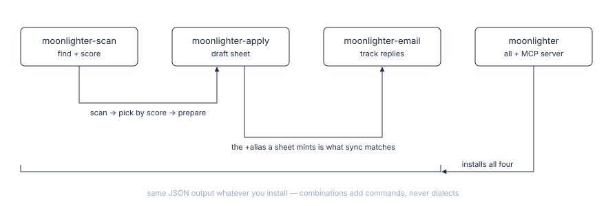

🇺🇸 [English](README.md) · 🇧🇷 [Português](README.pt.md)


# moonlighter

**O assistente de candidaturas que deixa a última palavra com você.**

Escaneia os portais de vagas que você escolhe, dá uma nota a cada vaga comparando com o seu perfil e rascunha uma folha de respostas completa a partir dos seus próprios dados, sinalizando o que não consegue responder.

Feito por Alberto Cavalcanti · [Fale comigo no LinkedIn](https://www.linkedin.com/in/albertosca/) · [Leia a documentação](https://albertosca.github.io/moonlighter/pt/) · [Instale](https://albertosca.github.io/moonlighter/pt/getting-started/install/)

<!-- facts -->1.700+ testes · 100% de cobertura de branches (gate no CI) · 5 pacotes no PyPI · mypy strict<!-- /facts -->

[](https://pypi.org/project/moonlighter/) [](https://pypi.org/project/moonlighter/) [](https://github.com/albertosca/moonlighter/actions/workflows/ci.yml) [](LICENSE) [](https://github.com/albertosca/moonlighter/actions/workflows/ci.yml) [](https://github.com/albertosca/moonlighter/actions/workflows/ci.yml)

## Sessenta segundos disso

```text
Você: varre minhas empresas

moonlighter: 3 fontes varridas — 41 vagas, 38 já conhecidas, 3 novas
  ✓ NOVA — Acme Robotics / Senior Backend Engineer
    Score: 8.1/10  (corte: 6.5)
  ✓ NOVA — Nimbus Health / Staff Engineer
    Score: 7.4/10
  ✗ Vandelay Industries / .NET Architect — 3.2/10, arquivada (filtro duro: .NET)

Você: prepara a candidatura da Acme

moonlighter: Senior Backend Engineer — Acme Robotics

  [1/9] Full name  (required)
  Ana Lima

  [2/9] Email  (required)
  ana.jobs+k3xv9qhm@gmail.com     ← alias de rastreio: a resposta da Acme casa sozinha com esta candidatura

  [3/9] Why do you want to work at Acme?  (required)
  Três frases rascunhadas a partir do perfil da Ana.

  [4/9] Desired salary  (required)
  BRL 28.000/month

  [5/9] Do you hold a US work visa?  (required)
  !! I DON'T KNOW — no basis in your profile to answer

  1 of 9 need you

Você: (revisa, cola no formulário, aperta enviar — o moonlighter nunca aperta)
```

A conversa é ilustrativa: o Claude repassa a saída das ferramentas com as próprias palavras. A lacuna é comportamento real — o modelo é instruído a responder UNKNOWN quando o seu perfil não dá base para responder, e a folha devolve essa pergunta para você.

## Como funciona

<picture>
  <source media="(prefers-color-scheme: dark)" srcset="assets/diagrams/how-it-works-dark.svg">
  
</picture>

- **Scan** — lê as vagas no Greenhouse, Lever, Ashby, Recruitee, Workable, SmartRecruiters e InHire das empresas que você lista, além de portais de vagas opcionais que você liga na config.
- **Avaliação** — um LLM dá nota a cada vaga comparando com o seu perfil; vagas abaixo do seu corte são arquivadas.
- **Preparo** — rascunha uma resposta para cada pergunta do formulário numa folha só, que você revisa, cola e envia; opcionalmente, um CV de uma página sob medida para a vaga.
- **Rastreio** — casa as respostas de recrutadores no Gmail com a candidatura certa pelo `+alias` e move o seu pipeline adiante.

Você comanda tudo de uma conversa com o Claude, por ferramentas MCP; os pacotes scan, apply e email também instalam linhas de comando em JSON para shells e cron jobs.

## O que ele não faz

- **Ele nunca envia uma candidatura.** Ele rascunha a folha; você cola as respostas no formulário do empregador e envia por conta própria.
- **Seu pipeline mora num arquivo SQLite local.** Vagas, rascunhos e histórico de candidaturas são guardados em `MOONLIGHTER_HOME`. O que sai da sua máquina é só o que vai para o LLM e para as APIs que você configura — Claude, Gmail, os portais de vagas. O [PRIVACY.md](PRIVACY.md) (em inglês) tem os detalhes.
- **O modelo nunca responde uma pergunta que as guardas reconhecem como de salário, compliance ou dados demográficos.** Essas respostas vêm do seu perfil ou config, ou ficam com você. As guardas reconhecem formulações conhecidas, e quando você cola o texto de uma página, o modelo ainda lê o texto inteiro para encontrar as perguntas.

O modelo ainda pode errar uma resposta — e é por isso que toda folha passa pela sua revisão.

## Decisões de engenharia

As candidaturas saem com o seu nome, então a régua é confiança. Cada decisão abaixo comprou segurança a um preço; a [página de Engenharia](https://albertosca.github.io/moonlighter/pt/engineering/) registra o que cada uma custou e onde conferir isso no código.

| Decisão | Custo que aceitamos |
|---|---|
| [Deixamos de dirigir o browser](https://albertosca.github.io/moonlighter/pt/engineering/#deixamos-de-dirigir-o-browser) | Cada candidatura custa a você uma colagem e um clique |
| [Guardas determinísticas em volta da etapa de redação](https://albertosca.github.io/moonlighter/pt/engineering/#guardas-deterministicas-em-volta-da-etapa-de-redacao) | Elas só reconhecem formulações conhecidas |
| [Texto do modelo escapado no LaTeX do CV, nunca validado](https://albertosca.github.io/moonlighter/pt/engineering/#texto-do-modelo-escapado-nunca-validado-no-latex-do-cv) | A saída do modelo não carrega formatação LaTeX além de negrito |
| [Cinco fatias com fronteira de import testada e releases em lockstep](https://albertosca.github.io/moonlighter/pt/engineering/#cinco-fatias-com-fronteira-de-import-testada-e-releases-em-lockstep) | Todo release sobe a versão de cinco pacotes à mão |
| [100% de cobertura de branches como gate, gates provados por canários](https://albertosca.github.io/moonlighter/pt/engineering/#100-de-cobertura-de-branches-como-gate-gates-provados-por-canarios) | Todo branch novo custa um teste |

## Instalação

Você precisa do [uv](https://docs.astral.sh/uv/) (ele baixa o Python 3.14 para você) e de um backend de LLM: o Claude Code CLI por padrão, ou uma API key da Anthropic.

- **Claude Code:** `/plugin marketplace add albertosca/moonlighter`, depois `/plugin install moonlighter@moonlighter`.
- **Qualquer outro cliente MCP:** registre o comando do servidor `uvx moonlighter`.
- **Depois:** `uvx moonlighter init` escreve a sua config; preencha `profile.yaml` e `company_list.yaml` e peça ao Claude "varre minhas empresas".

[Guia completo de instalação →](https://albertosca.github.io/moonlighter/pt/getting-started/install/)

<picture>
  <source media="(prefers-color-scheme: dark)" srcset="assets/diagrams/fitting-dark.svg">
  
</picture>

## Documentação

- [Primeiros passos](https://albertosca.github.io/moonlighter/pt/getting-started/install/) — requisitos, o assistente de configuração, o registro do servidor MCP
- [CV sob medida](https://albertosca.github.io/moonlighter/pt/guides/tailored-cv/) — um CV LaTeX de uma página por vaga, montado a partir dos bullets que você curou
- [Banco de respostas](https://albertosca.github.io/moonlighter/pt/guides/answer-bank/) — respostas de triagem que você aprovou, reaproveitadas na próxima candidatura
- [Linha de comando](https://albertosca.github.io/moonlighter/pt/reference/cli/) — uma CLI em JSON por fatia, códigos de saída, o que cada instalação oferece
- [Ferramentas MCP](https://albertosca.github.io/moonlighter/pt/reference/mcp-tools/) — as 17 ferramentas que o Claude chama por você
- [Extensões](https://albertosca.github.io/moonlighter/pt/guides/extensions/) — adicione uma fonte de vagas como um pacote separado

Dúvidas e solução de problemas: [Perguntas frequentes](https://albertosca.github.io/moonlighter/pt/faq/). Para mexer no código: [CONTRIBUTING.md](CONTRIBUTING.md) (em inglês).

## Licença

AGPL-3.0 — veja [LICENSE](LICENSE): use, faça fork, modifique, desde que o que você distribuir ou servir pela rede continue aberto. Quer oferecer o moonlighter como serviço hospedado ou pago sem as obrigações da AGPL? Existe licença comercial — [abra uma issue](https://github.com/albertosca/moonlighter/issues) para começar essa conversa; o [CLA](CLA.md) que todo contribuidor assina mantém essa oferta possível.

O [DISCLAIMER.md](DISCLAIMER.md) (em inglês) trata de termos de serviço, automação e uso do backend de LLM; o [PRIVACY.md](PRIVACY.md) (em inglês) trata do que a ferramenta guarda e para onde vai.

---

Feito por Alberto Cavalcanti — [Fale comigo no LinkedIn](https://www.linkedin.com/in/albertosca/)
